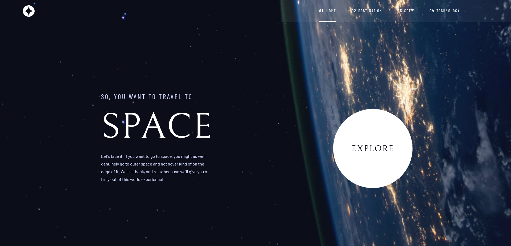

# Frontend Mentor - Space tourism website solution

This is a solution to the [Space tourism website challenge on Frontend Mentor](https://www.frontendmentor.io/challenges/space-tourism-multipage-website-gRWj1URZ3). Frontend Mentor challenges help you improve your coding skills by building realistic projects.

## Table of contents

- [Overview](#overview)
  - [The challenge](#the-challenge)
  - [Screenshot](#screenshot)
  - [Links](#links)
  - [Built with](#built-with)
  - [What I learned](#what-i-learned)
  - [Useful resources](#useful-resources)
- [Author](#author)

## Overview

### The challenge

Users should be able to:

- View the optimal layout for each of the website's pages depending on their device's screen size
- See hover states for all interactive elements on the page
- View each page and be able to toggle between the tabs to see new information

### Screenshot

### Links

- Solution URL: [Here](https://github.com/Marcosfitzsimons/space-tourism-website)
- Live Site URL: [Here](https://space-tourism-website-lyart.vercel.app/)

### Built with

- Semantic HTML5 markup
- CSS custom properties
- Flexbox
- CSS Grid
- Mobile-first workflow
- [React](https://reactjs.org/) - JS library
- [Framer Motion](https://www.framer.com/motion/) - Motion library for React
- [TailwindCSS](https://tailwindcss.com/) - For styles

### What I learned

#### Accesibility:

- aria-hidden ---> removes that element and all of its children from the accessibility tree. (NavLinks numbers - SectionTitle numbers)
- aria-selected attribute ---> to indicates the current "selected" tab
- sr-only ---> to hide an element visually without hiding it from screen readers

Switch between each page with React Router DOM v6.3

## Author

- Website - [Marcos Valentín Fitzsimons](https://marcosfitzsimons-portfolio.vercel.app/)
- Frontend Mentor - [@Marcosfitzsimons](https://www.frontendmentor.io/profile/Marcosfitzsimons)
